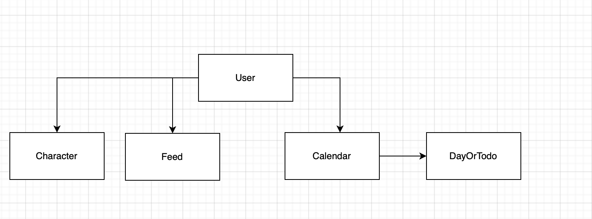

# 12조 팀 프로젝트

<hr />

# (Schedule Monster)

- 일정을 관리하면서 포켓몬을 수집하세요

## 서비스 구성 안내

## 1. 서비스 소개

- 기술 스택 (Bulma css, node, mongodb, express)
- 일정을 관리하며 수집의 즐거움을 느껴보세요
- 캘린더, To-Do list를 작성하며 포켓몬을 수집합니다.


## 2. 서비스 주요 기능 설명

**웹서비스의 유용성, 편의성 및 시각화의 실용성에 대한 설명**

- 일정 공유 기능
- 엑셀 파일로 일정 등록
- 일정 달성율 알림 기능
- Todo 타이머 기능

## 3. 서비스 구성도

- 서비스 구조도 그림 (사용한 기술 스택)


- 와이어프레임 링크 
  
  [와이어프레임]([Figma](https://www.figma.com/file/ci9zZyQ3rHygsDzOfBuIre/Schedule_Monster?node-id=0%3A1))
  
  
- API 명세를 문서화한 링크
  
  [API 명세]([Notion – The all-in-one workspace for your notes, tasks, wikis, and databases.](https://mirage-cardboard-868.notion.site/API-6605e3921b154407a3179673937b2b1d))
  
  
-   DB 모델링
  
  
  
  DB 관련 링크 : 
  
   [DB 스키마](https://mirage-cardboard-868.notion.site/DB-d011b31d832a45258fd8343f303a8a85)


## 4. 프로젝트 팀원 역할 분담

| 이름  | 담당 업무              | 이름  | 담당 업무             |
|:---:|:------------------:|:---:|:-----------------:|
| 유상우 | 팀장 / 백엔드 / 캘린더, 유저 | 김민경 | 프론트엔드 / 캐릭터 관리    |
| 채유진 | 백엔드 / 캐릭터, 아이템, 상점 | 김현율 | 프론트엔드 / 일정(캘린더)   |
|     |                    | 박지찬 | 프론트엔드 / 관리자       |
|     |                    | 신연주 | 프론트엔드 / 메인화면, 로그인 |
|     |                    |     |                   |

**멤버별 responsibility**

1. 유상우 : 팀장/백엔드 담당
- 기획 단계: 구체적인 설계와 지표에 따른 프로젝트 제안서 작성
- 개발 단계: 팀원간의 일정 등 조율 + 백엔드 개발
- 수정 단계: 기획, 스크럼 진행, 코치님 피드백 반영해서 수정, 발표 준비


2. 채유진: 백엔드 담당
- 기획 단계: DB 스키마 설계, API 명세서 초안 작성
- 개발 단계: 백엔드 Issue 정리, 캐릭터, 아이템 관련 API 개발
- 수정 단계: 피드백 반영해서 백엔드 설계 수정


3.  김민경 : 프론트엔드 담당
- 기획 단계: 구체적인 설계와 지표에 따른 프로젝트 제안서 작성

- 개발 단계: 팀원간의 일정 등 조율 + 프론트 or 백엔드 개발

- 수정 단계: 기획, 스크럼 진행, 코치님 피드백 반영해서 수정, 발표 준비


3. 김현율 : 프론트엔드 담당
- 기획 단계: 구체적인 설계와 지표에 따른 프로젝트 제안서 작성

- 개발 단계: 팀원간의 일정 등 조율 + 프론트 or 백엔드 개발

- 수정 단계: 기획, 스크럼 진행, 코치님 피드백 반영해서 수정, 발표 준비


3. 박지찬 : 프론트엔드 담당
- 기획 단계: 구체적인 설계와 지표에 따른 프로젝트 제안서 작성

- 개발 단계: 팀원간의 일정 등 조율 + 프론트 or 백엔드 개발

- 수정 단계: 기획, 스크럼 진행, 코치님 피드백 반영해서 수정, 발표 준비


3. 신연주 : 프론트엔드 담당
- 기획 단계: 구체적인 설계와 지표에 따른 프로젝트 제안서 작성

- 개발 단계: 팀원간의 일정 등 조율 + 프론트 or 백엔드 개발

- 수정 단계: 기획, 스크럼 진행, 코치님 피드백 반영해서 수정, 발표 준비

- 

## 5. 실행 방법


#### 백엔드 : 실행 방법

```bash
1. yarn install     ## node package 설치
2. yarn dev    ## 실행


```

#### .env 파일 설정 예시

```.env
MONGODB_URI = "mongodb://localhost:27017/"
PORT = 5000
```


## 6. 버전

- 프로젝트의 버전 (1.0.0) 

## 7. FAQ

- 자주 받는 질문 정리
- 예시) 이 서비스는 어떻게 실행하면 되나요?
  - git clone을 하신 후 아래 커맨드를 입력하시면 됩니다. ~~~
